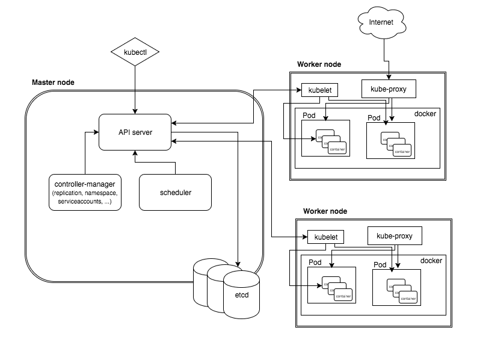
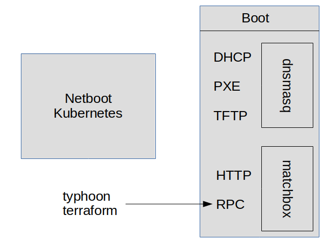
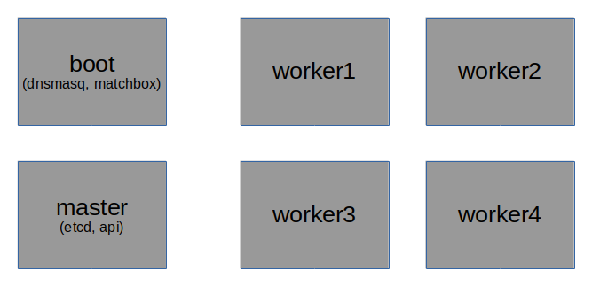

# From bare metal to serverless


### About me:

* Michael Schnupp
* studied CS in Jena
* Researcher at TUM
* Software-Consultant (Java, Enterprise, ...)
* Microkernel developer/researcher (L4)
* "Cloud"-Guy
* Finding and solving problems

=> Currently at ippen-digital.de (tz, merkur, etc.)

(No regular speaker - feedback welcome!)


### Hosting services over time:

* physical (bare metal)
* local VMs
* Cloud services like AWS EC2
* Containers (JEE, Docker)
* Kubernetes (Platform for building platforms)
* FAAS (Lambda, serverless,...)


### Situation at ippen-digital

Migration from datacenter to "Cloud":

|     old world             |  current world |
|---------------------------|---------------------|
|datacenter                 | rancher             |
|monolith                   | microservices       |
|WAR-files                  | docker images       |
|SVN                        | git                 |
|Deploy by shell/rsync      | rancher catalog     |
|cruisecontrol              | gitlab CI           |


New world: Based on Kubernetes

| <br>kubeless |   <br>???  | knative<br>istio |
|:------------:|:----------:|:----------------:|
|              |   k8s      |                  |
|              | bare metal |                  |


### How to make use of existing physical hosts?

In our case: 6 hosts - no supporting infrastructure





### How to get a kubernetes cluster?

* Google GKE
* Amazon EKS
* kubeadm
* kubespray (ansible)
* NixOS
* typhoon (terraform)


### The architecture for typhoon




configure boot server:
```
networkd:
  units:
    - name: static.network
      contents: |
        [Match]
        Name=enp4s0f0

        [Network]
        Address=10.100.4.241/28
        Gateway=10.100.4.254
        DNS=8.8.8.8

systemd:
  units:
    - name: dnsmasq.service
      enabled: true
      contents: |
        [Unit]
        Description=CoreOS dnsmasq Server
        
        [Service]
        ExecStart=/usr/bin/rkt run --net=host quay.io/coreos/dnsmasq:v0.5.0
        
    - name: matchbox.service
      enabled: true
      contents: |
        [Unit]
        Description=CoreOS matchbox Server
        
        [Service]
        ExecStart=/usr/bin/rkt run quay.io/coreos/matchbox:v0.7.0
```


configure cluster:
```
module "datalake" {
  source = "git::https://github.com/poseidon/typhoon//bare-metal/container-linux/kubernetes?ref=v1.13.2"

  # bare-metal
  cluster_name            = "datalake"
  matchbox_http_endpoint  = "http://boot.datalake.ippen.io:8080"
  os_channel              = "coreos-stable"
  os_version              = "1855.4.0"

  # configuration
  k8s_domain_name    = "master.datalake.ippen.io"
  asset_dir          = "files"
  cached_install     = "true"

  # machines
  controller_names   = ["master"]
  controller_macs    = ["a0:36:9f:20:73:e0"]

  worker_names   = [ "node1", "node2", "node3", "node4" ]
  worker_macs    = [ "a0:36:9f:1f:c3:4c", "a0:36:9f:20:70:04", "a0:36:9f:20:73:ec", "a0:36:9f:20:73:4c" ]
}
```


### What do we have?



* Complete control over all servers        <!-- .element: class="fragment" data-fragment-index="1" -->
* Clear definition                         <!-- .element: class="fragment" data-fragment-index="1" -->
* Full automatic k8s setup                 <!-- .element: class="fragment" data-fragment-index="1" -->
* => kubectl is able to manage the cluster :) <!-- .element: class="fragment" data-fragment-index="1" -->


### What is missing?

* volumes              <!-- .element: class="fragment" data-fragment-index="1" -->
* loadbalancer         <!-- .element: class="fragment" data-fragment-index="1" -->
* ingress controller   <!-- .element: class="fragment" data-fragment-index="1" -->
* DNS management       <!-- .element: class="fragment" data-fragment-index="1" -->
* TLS certificates     <!-- .element: class="fragment" data-fragment-index="1" -->
* authentication       <!-- .element: class="fragment" data-fragment-index="1" -->


### What is missing?

* volumes: rook
* loadbalancer: metallb
* ingress controller: traefik (or nginx)
* DNS management: external-dns
* TLS certificates: cert-manager
* authentication: todo


### What is next?

Kelsey Hightower: 

> Kubernetes is a platform for building platforms. <br>
> It's a better place to start; not the endgame.

* kubeless  <!-- .element: class="fragment" data-fragment-index="1" -->
* istio     <!-- .element: class="fragment" data-fragment-index="1" -->
* knative   <!-- .element: class="fragment" data-fragment-index="1" -->


### kubeless

* function as a service on K8s
* nice integration of messaging (Kafka and NATS)


Write a fuction:
```python
def reverse(event, context):
  print event
  return event['data'][::-1]
```

Connect it to URL or kafka topic:
```bash
kubectl create -f https://github.com/kubeless/kubeless/releases/download/v1.0.0/kubeless-v1.0.0.yaml

kubeless function deploy reverse --runtime python2.7 --handler test.reverse --from-file test.py
kubeless trigger http create ingress-reverse --function-name reverse --hostname reverse.ippen.cloud
curl --data 'foobar' https://reverse.ippen.cloud/

kubectl create -f https://github.com/kubeless/kafka-trigger/releases/download/v1.0.0/kafka-zookeeper-v1.0.0.yaml

kubeless topic create foo
kubeless trigger kafka create kafka-test --function-selector function=reverse --trigger-topic foo
kubeless topic publish --topic foo --data "Hello World!"
```


* Functions are not an option?
* Want to use existing docker images?

You might use:      <!-- .element: class="fragment" data-fragment-index="1" -->

* Plain Kubernetes  <!-- .element: class="fragment" data-fragment-index="1" -->
* Istio             <!-- .element: class="fragment" data-fragment-index="2" -->
* Knative           <!-- .element: class="fragment" data-fragment-index="3" -->
* Anything else?    <!-- .element: class="fragment" data-fragment-index="4" -->


Istio:
* communication by proxy
* monitoring/tracing/intelligent routing

Knative:                                      <!-- .element: class="fragment" data-fragment-index="1" -->
* Building (Source to docker)                 <!-- .element: class="fragment" data-fragment-index="1" -->
* Serving  (Automatic scaling 0-n, revisions) <!-- .element: class="fragment" data-fragment-index="1" -->
* Eventing                                    <!-- .element: class="fragment" data-fragment-index="1" -->


# Questions?
